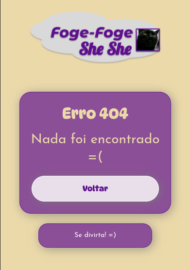

# foge-foge-she-she

> Status do projeto: Concluído

Foge Foge She She é um jogo estilo pacman feito em homenagem a uma amiga e seu gato Sherlock.

| :placard: Vitrine.Dev |     |
| -------------  | --- |
| :sparkles: Nome        | **Foge Foge She She**
| :label: Tecnologias | React, TypeScript, HTML, CSS
| :rocket: URL         | <https://foge-foge-she-she.vercel.app/>


## Detalhes do projeto

O jogo foi desenvolvido com React e TypeScript, usando bastante dos React states para armazenar o estado atual do jogo, que é definido por várias variáveis diferentes, como a pontuação, mapa da fase atual, personagens presentes e a posição deles, se o especial está ativo e também se o usuário ganhou ou perdeu. Todas as páginas são animadas com a biblioteca animate.css.

O app usa várias funções auxiliares da pasta util para aplicar várias regras do jogo, como verificar se o espaço do mapa para onde o jogador que ir é válido ou se o personagem do jogador está preso, sem nenhum movimento válido, para que o evento de perder aconteça.

As várias fases disponíveis são armazenadas no arquivo fases da pasta data, na forma de uma lista de objetos contendo a representação da fase como caracteres, que serão mapeados para imagens específicas. Todos os textos do app são encapsulados, por ser uma boa prática caso seja preciso trocar algum texto ou adicionar outro idioma.

A aplicação contém testes automatizados com Jest divididos em 4 suites, três sendo responsáveis por garantir que cada página da aplicação é renderizada corretamente, com os elementos e comportamentos esperados. Enquanto há uma suite específica para a lógica do jogo, que verifica se o comportamento dos personagens respeita as regras do jogo e os eventos de vitória e derrota acontecem como esperado.

## Páginas

### Página Inicial - Introdução ao jogo e seleção da fase


---

### Jogo - Contém o jogo em si, com a pontuação e o mapa da fase atual


---

### Tela Final - Após o término do jogo, mostra sua pontuação final, mensagem de vitória/derrota e ações para jogar novamente, voltar ao início ou ir para próxima fase


### Não Encontrado - Página de erro padrão



---

## Comandos para configurar e executar o projeto

O projeto utiliza o npm para gerenciar as dependências e contém testes automatizados com jest. Os testes são divididos em 4 partes, três para garantir que cada uma das páginas (Página inicial, interface do jogo e não encontrado) são renderizadas corretamente, com todos os elementos necessários, e uma para garantir que o jogo pode ser jogado, contendo o comportamento esperado.

```bash
git clone https://github.com/BrenoMorim/foge-foge-she-she.git foge-foge-she-she
cd foge-foge-she-she
npm install
npm test
npm start
```

## Inicializando com Docker

O projeto também dá suporte a inicialização com Docker, usando a imagem base node:18-alpine, o container está configurado para rodar na porta 3000.

```bash
git clone https://github.com/BrenoMorim/foge-foge-she-she.git foge-foge-she-she
cd foge-foge-she-she
./criar_imagem_docker.sh
docker compose up
```
